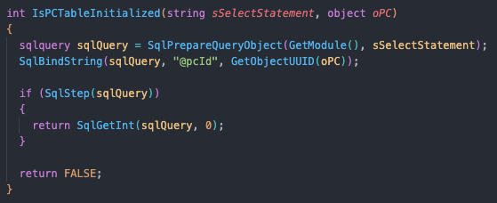
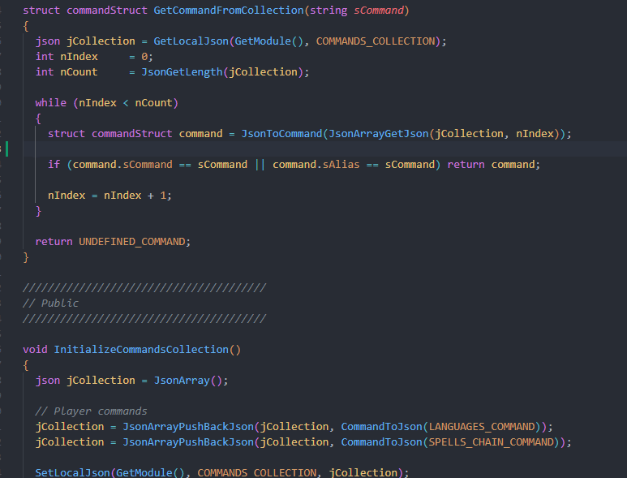
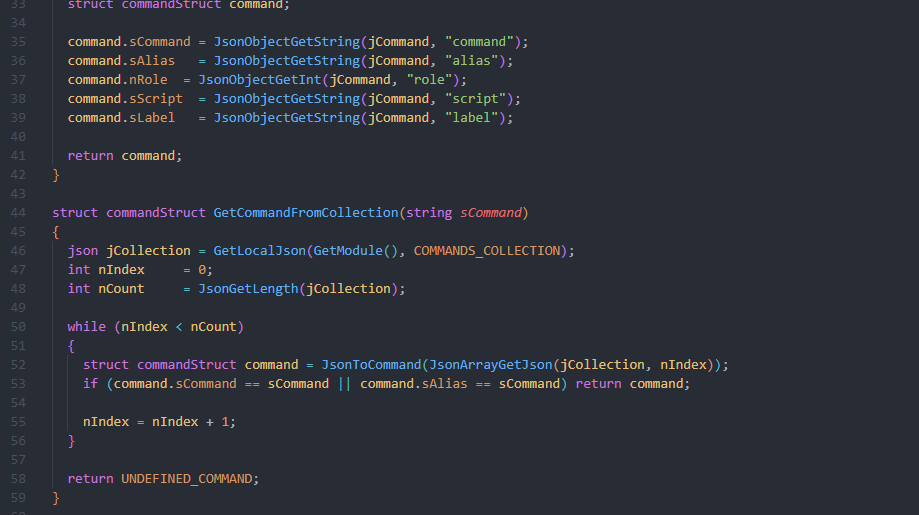

# README

NWScript: EE Language Server is a Visual Studio extension LSP for the NWScript language.

While it seems to work well, even in bigger and older code bases, it is still an early project and there might be some unintended behaviours.

If you wish to have formatting on top of that, take a look at this other [extension](https://github.com/PhilippeChab/nwscript-formatter). It was written before the LSP, hence why the formatting is not included directly in it. I will migrate it to the LSP eventually if I have time.

## Dependencies

None.

## Usage

Simply open a project with nss files and the extension installed. The extension will index your files and you will be ready to go - it can currently take up to 20-30 seconds to index
big projects.

## Features

Enhanced syntax highlighting:

Completion:

Hover information:

Goto definition:

